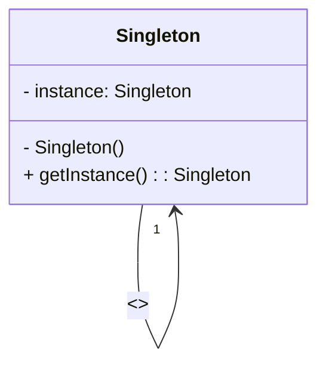

# Design_Patterns_with-\_Java

markdown

## Padrão Singleton

O padrão Singleton é um padrão de projeto criacional que garante a existência de apenas uma instância de uma determinada classe em toda a aplicação, fornecendo uma forma de recuperá-la.

Existem diversas maneiras de implementar o Singleton, mas as três mais comuns são:

### Lazy Initialization

Nesta abordagem, a instância só é criada quando é realmente necessária, o que pode ajudar a economizar recursos de memória. O exemplo a seguir ilustra esta abordagem:

```java
public class Singleton {
    private static Singleton instance;

    private Singleton() {}

    public static Singleton getInstance() {
        if (instance == null) {
            instance = new Singleton();
        }

        return instance;
    }
}
```

### Eager Singleton

Nessa implementação, a instância é criada logo na declaração da variável, tornando a criação da instância mais rápida.

```java
public class EagerSingleton {
   private static final EagerSingleton instance = new EagerSingleton();

   private EagerSingleton() {}

   public static EagerSingleton getInstance() {
      return instance;
   }
}
```

### Lazy Holder Singleton

Nessa implementação, a instância é encapsulada em uma classe privada, que é carregada somente quando a instância é chamada pela primeira vez.

```java
public class LazyHolderSingleton {
   private LazyHolderSingleton() {}

   private static class SingletonHolder {
      private static final LazyHolderSingleton instance = new LazyHolderSingleton();
   }

   public static LazyHolderSingleton getInstance() {
      return SingletonHolder.instance;
   }
}
```

### Diagrama de classes UML

Para ilustrar melhor como funciona o padrão Singleton, apresentamos abaixo um diagrama de classes UML:


