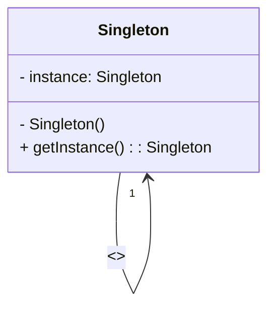

# Design Patterns With Java

## Padrão Singleton

O padrão Singleton é um padrão de projeto criacional que garante a existência de apenas uma instância de uma determinada classe em toda a aplicação, fornecendo uma forma de recuperá-la.

Existem diversas maneiras de implementar o Singleton, mas as três mais comuns são:

### Lazy Initialization

Nesta abordagem, a instância só é criada quando é realmente necessária, o que pode ajudar a economizar recursos de memória. O exemplo a seguir ilustra esta abordagem:

```java
public class Singleton {
    private static Singleton instance;

    private Singleton() {}

    public static Singleton getInstance() {
        if (instance == null) {
            instance = new Singleton();
        }

        return instance;
    }
}
```

### Eager Singleton

Nessa implementação, a instância é criada logo na declaração da variável, tornando a criação da instância mais rápida.

```java
public class EagerSingleton {
   private static final EagerSingleton instance = new EagerSingleton();

   private EagerSingleton() {}

   public static EagerSingleton getInstance() {
      return instance;
   }
}
```

### Lazy Holder Singleton

Nessa implementação, a instância é encapsulada em uma classe privada, que é carregada somente quando a instância é chamada pela primeira vez.

```java
public class LazyHolderSingleton {
   private LazyHolderSingleton() {}

   private static class SingletonHolder {
      private static final LazyHolderSingleton instance = new LazyHolderSingleton();
   }

   public static LazyHolderSingleton getInstance() {
      return SingletonHolder.instance;
   }
}
```

### Diagrama de classes UML

Para ilustrar melhor como funciona o padrão Singleton, apresentamos abaixo um diagrama de classes UML:



## Padrão de Design Strategy

O padrão de design Strategy é uma técnica de programação que permite definir diferentes estratégias para executar uma mesma tarefa. Ele é especialmente útil em sistemas complexos que exigem diferentes abordagens para uma mesma tarefa, como no caso de um robô que precisa executar diferentes tipos de movimentos.

## Exemplo de uso

No exemplo abaixo, utilizamos o padrão de design Strategy para criar um robô que pode executar diferentes tipos de movimentos. Para isso, criamos uma interface Behavior que define os métodos necessários para cada tipo de movimento. Em seguida, criamos três classes que implementam essa interface: NormalBehavior, FightBehavior e DefenseBehavior.

```java
public interface Behavior {
    public void move();
}

public class NormalBehavior implements Behavior {
    public void move() {
        System.out.println("Movimento normal");
    }
}

public class FightBehavior implements Behavior {
    public void move() {
        System.out.println("Movimento de luta");
    }
}

public class DefenseBehavior implements Behavior {
    public void move() {
        System.out.println("Movimento de defesa");
    }
}
```

Em seguida, criamos a classe Robot que recebe um objeto do tipo Behavior no construtor. O método move do robô simplesmente chama o método move do objeto Behavior passado.

```java
public class Robot {
    private Behavior behavior;

    public Robot(Behavior behavior) {
        this.behavior = behavior;
    }

    public void move() {
        behavior.move();
    }
}
```

Dessa forma, podemos criar um robô que executa diferentes tipos de movimentos simplesmente passando um objeto Behavior diferente no construtor. Por exemplo:

```java
Behavior normalBehavior = new NormalBehavior();
Robot robot1 = new Robot(normalBehavior);
robot1.move();  // imprime "Movimento normal"

Behavior fightBehavior = new FightBehavior();
Robot robot2 = new Robot(fightBehavior);
robot2.move();  // imprime "Movimento de luta"

Behavior defenseBehavior = new DefenseBehavior();
Robot robot3 = new Robot(defenseBehavior);
robot3.move();  // imprime "Movimento de defesa"
```

Vantagens do padrão de design Strategy

- Torna o código mais modular, flexível e fácil de manter.
- Permite definir diferentes estratégias para executar uma mesma tarefa.
- Evita a criação de um algoritmo complexo e difícil de manter.
- Torna o código mais legível, porque cada classe estratégia é nomeada de acordo com sua função específica.

Conclusão

O padrão de design Strategy é uma técnica de programação muito útil que pode simplificar a utilização de algoritmos em um sistema, tornando o código mais modular, flexível e fácil de manter. No exemplo acima, utilizamos esse padrão para criar um robô que pode executar diferentes tipos de movimentos, mas ele pode ser aplicado em diversas outras situações em que diferentes abordagens para uma mesma tarefa são necessárias.
